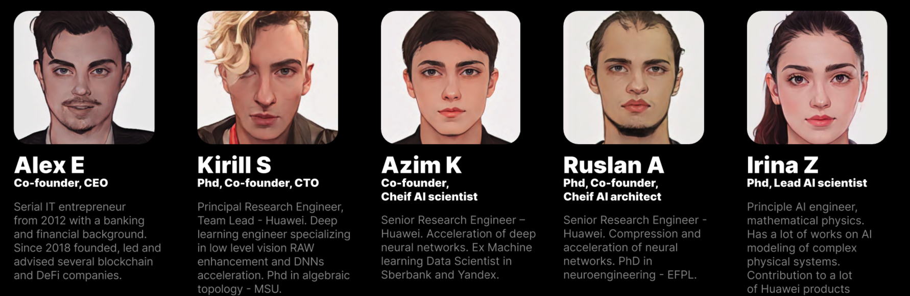

# Thestage.AI 项目记录表

关键词：AI；技术导向；隐私安全；计算资源

对接人员：Alex, Kirill - Young

## 目录

1. 简介
2. 团队
3. 核心技术
4. Demo介绍
5. 开发进展
1. 竞品分析
2. 融资需求
3. 媒体

## 1. 简介

Thestage.ai是一个由顶级人工智能学者和从业者组成的团队建立的Web3人工智能平台。我们帮助人工智能研究人员和工程师获得工具和更便宜的计算资源来训练他们的人工智能模型，并通过提供分散的计算能力、访问预训练的验证SOTA模型和训练证明机制来提供直观的一键部署，这使得模型可以注册为安全的多指标。

## 2. 团队

团队拥有深厚的技术背景，团队成员中有多位Phd。其中，Kirill毕业于美国密西根大学的拓扑几何学，他对于我们的项目的理论支持和指导至关重要。除此之外，我们的团队还发表了多篇顶级论文，展现了我们在学术领域的实力和影响力。特别地，我们的团队在2023年发表了最新的CVPR，这篇论文题目为 “[Integral Neural Networks](https://docsend.com/view/tje8hdyrhajjgupb)”。这篇论文是我们的团队精益求精、不断探索的结果，我们对于未来的研发和技术探索充满信心。

Alex：CEO，金融背景

Kirill：CTO，华为背景，Team lead

Azim K：首席Ai科学家

Ruslan A：首席Ai架构师

Irina Z：Phd，资深Ai科学家

## 3. 核心技术

主要应用技术

我们的系统采用了多种技术，包括区块链、zk计算、同态加密、机器学习和深度学习。这些技术中，区块链技术是一种去中心化的分布式账本技术，可以确保数据的安全性和不可篡改性。同态加密技术则能够在加密的同时支持加法和乘法等运算，大大提高了数据的计算效率。zk计算是一种零知识证明技术，可以保证用户的隐私不被泄露。机器学习和深度学习则是现代人工智能领域的核心技术，可以让我们的系统不断学习和进化，以更好地满足用户的需求。

架构解读：

用户或企业将数据上传到区块链，使用通态加密和ZK算法确保数据的安全性，然后上传数据到云存储的数据中心等待使用。最后，选择适合的NFT模型进行训练。模型提供商上传模型到区块链上，获得训练证明，模型被打包成NFT并进入市场，为用户提供模型服务。平台从数据上传、模型使用和硬件使用的服务中收取2%的手续费。

## 4. Demo介绍

### 搜索最佳模型

搜索引擎 - 上传自己的模型提供服务获得奖励 - 简化训练流程

### 训练模型

上传数据到项目方的云存储空间 - 选择框架 - 使用项目方的infrastructure训练模型  - 验证模型

### 加速模型训练 4x

## 5. 开发进展

Thestage.AI于2022年Q4发起，目前已经建立了web3第一个ai模型的应用平台。平台上已经有超过1000+模型可供选择，收益已经达到了15万美金以上。未来目标是打造一个完整的ai链上生态，为链上有ai需求的人提供服务。他们后续计划增加全同态加密的zk计算来确保隐私安全性，并于2024年Q4上线主网。

## 6. 竞品分析

### Thestage_vs_Cortex

总结：Cortex为智能合约增加了AI的能力，能够直接通过Solidity调用智能合约，但无法提供训练和部署模型的服务，也没有模型市场，并且不支持深度学习。Thestage更注重打造全链的AI模型生态，为开发者提供AI服务。区块链在其中扮演的主要角色是市场，同时支持深度学习。

## 7. 融资需求

本轮融资2%, 100万美元，0.05单价，估值5000万，估值逻辑参照同类竞品得出的估值。

[竞品hugging face融资情况](../01_ThestageAI_AI/img/%E7%AB%9E%E5%93%81hugging%20face%E8%9E%8D%E8%B5%84%E6%83%85%E5%86%B5%2005f2d9945f704820b1d3a033ce6f4a1f_all.csv)

### Hugging Face融资情况

2022 年 5 月，Hugging Face 完成 1 亿美元的 C 轮融资，估值达到 20 亿美元，C 轮由 Lux Capital 领投，其他投资方包括 Sequoia US、Coatue 等。**Hugging Face 目前拥有 1,000 多名客户，包括英特尔、高通、辉瑞和彭博社等。据透露，Hugging Face 2021 年收入约 1,000 万美元，并在 2022 年年中接近盈亏平衡。**

[2021 年 3 月，Hugging Face 在B 轮](https://en.wikipedia.org/wiki/Series_B)融资中筹集了 4000 万美元。

Hugging Face 大数据,人工智能 A 1500万美元 [Betaworks](https://www.01caijing.com/financing/investor/p1004072591.htm) [, A.Capital Ventures](https://www.01caijing.com/financing/investor/p1002924010.htm) [, Thirty Five Ventures](https://www.01caijing.com/financing/investor/p1004076274.htm) [, Richard Socher](https://www.01caijing.com/financing/investor/p1004075621.htm) [, Lux Capital](https://www.01caijing.com/financing/investor/p1000009285.htm)

Hugging Face是一家位于纽约的人工智能公司，专注于开发自然语言处理（NLP）技术。该公司的核心产品是一个叫做Transformers的库，这是一个用于训练和使用NLP模型的工具包。Transformers库包含了许多现成的预训练模型，可以在许多NLP任务中使用，例如文本分类、命名实体识别、问答等。此外，该公司还提供了一个叫做Model Hub的网站，用户可以在这里查找并下载各种不同的预训练模型。

除此之外，Hugging Face还提供了一些其他NLP工具，例如Tokenizers，一个用于文本预处理的库，以及Datasets，一个包含大量NLP数据集的工具包。

总的来说，Hugging Face是一家非常活跃的NLP公司，其Transformers库和其他工具已经成为NLP社区的重要资源，并且正在广泛使用和发展。

[thestage onepager v2.pdf](Thestage%20AI%20%E9%A1%B9%E7%9B%AE%E8%AE%B0%E5%BD%95%E8%A1%A8%2080b6e3f0a26748f0bc9cf54cd828a850/thestage_onepager_v2.pdf)

## 8. 媒体

1. 搜狐网：[https://www.sohu.com/a/670506805_121210895](https://www.sohu.com/a/670506805_121210895)
2. CSDN：[https://blog.csdn.net/weixin_56136405/article/details/130388070?spm=1001.2014.3001.5501](https://blog.csdn.net/weixin_56136405/article/details/130388070?spm=1001.2014.3001.5501)
3. iNFTnews：[https://inftnews.com/95273/](https://inftnews.com/95273/)
4. 百度：[https://mbd.baidu.com/newspage/data/landingshare?preview=1&pageType=1&isBdboxFrom=1&context={"nid"%3A"news_9711849593793516884"%2C"sourceFrom"%3A"bjh"}](https://mbd.5.baidu.com/newspage/data/landingshare?preview=1&pageType=1&isBdboxFrom=1&context=%7B%22nid%22%3A%22news_9711849593793516884%22%2C%22sourceFrom%22%3A%22bjh%22%7D)
6. Marsbit：[https://news.marsbit.co/20230426143422439452.html](https://news.marsbit.co/20230426143422439452.html)
7. 今日头条：[https://m.toutiao.com/article/7226263702033449472/?upstream_biz=toutiao_pc&wxshare_count=2](https://m.toutiao.com/article/7226263702033449472/?upstream_biz=toutiao_pc&wxshare_count=2)
8. Medium：[https://medium.com/@Web3CN_Pro/独家专访丨thestage-ai-当-ai-邂逅-web3-c43cdb69f22e](https://medium.com/@Web3CN_Pro/%E7%8B%AC%E5%AE%B6%E4%B8%93%E8%AE%BF%E4%B8%A8thestage-ai-%E5%BD%93-ai-%E9%82%82%E9%80%85-web3-c43cdb69f22e)
9. 知乎：[https://zhuanlan.zhihu.com/p/625098239](https://zhuanlan.zhihu.com/p/625098239)