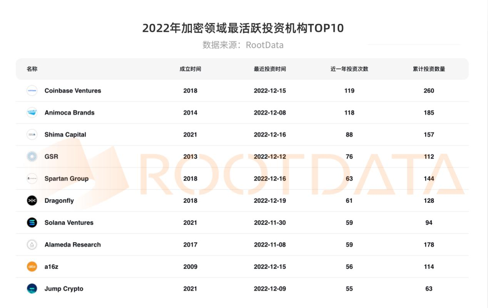

# 2023年Web3投资机构调研报告

## 目录

- [摘要](https://www.notion.so/2023-Web3-a988c93c7d1045f28868c76c5e053cab?pvs=21)
- [2022 年活跃投资者](https://www.notion.so/2023-Web3-a988c93c7d1045f28868c76c5e053cab?pvs=21)
- [2022 年加密风投基金募资情况](https://www.notion.so/2023-Web3-a988c93c7d1045f28868c76c5e053cab?pvs=21)
- [2022 年项目融资情况](https://www.notion.so/2023-Web3-a988c93c7d1045f28868c76c5e053cab?pvs=21)
- [2022年细分赛道的详细融资数据情况](https://www.notion.so/aa57f4b4e7604c4e9d4d9c4e7b8d6c50?pvs=21)
- [2023年Web3投资展望](https://www.notion.so/8d8f1e7d1c3a4e2389d8c3c3d3c084f3?pvs=21)

## 摘要

web3投资机构众多，这些风投广泛地分布于不同项目的各个发展阶段中，投资方式主要是股权和Token，机构类型包括传统vc和专业投资web3的机构，本文对部分web3投资机构进行调研，包含其主要背景，投资项目和投资特点等，并对2022年web3行业的投融资情况总体进行了介绍。

### 领投VC

领投VC是指在某一轮融资中，投资金额最多、占比最高、对公司影响最大的风险投资机构。

下表总结了几家知名的web3投资机构的基本信息，包括名称、主要成员、成立时间、管理资金、投资领域、投资项目和投资特点。

| 名称 | 主要成员 | 成立时间 | 管理资金 | 投资领域 | 投资项目 | 竞争优势 |
| --- | --- | --- | --- | --- | --- | --- |
| A16z | Chris Dixon
Marc Andreessen
Arianna Simpson
Ali Yahya | 2009年 | 7.6 B 美元 | 主要专注于加密货币领域 | 14个独角兽公司，主要包括跨越协议层面、集中式和分散式基础设施、消费者应用和成熟的NFT项目，Anchorage、Dapper Labs、Coinbase、Opensea、LayerZero、Yuga Labs、Phantom | - 200多人的投资后台团队，涉及市场推广、运营、商业开发、伙伴关系、营销、人才和资本架构 |
| Paradigm | Fred Ehrsam
Matt Huang
Dan Robinson | 2018年 | 13.2 B 美元 | 投资范围很广，从100万美元的种子轮到超过1亿美元的成长轮。 | 包括15个独角兽公司，其中有10个是行业中的顶流：Coinbase, Chainalysis, Uniswap, Compound, Cosmos, Fireblocks, FTX US, Opensea, Magic Eden, Amber, Gauntlet, MoonPay, Phantom, optimistic, Sky Mavis和Starkware | - Paradigm 拥有与创始人一样的用于构建项目的技术能力，这是大多数公司无法提供的 |
| Multicoin Capital | Kyle Samani, Tushar Jain | 2017 | 2.5亿美元 | 包括但不限于数字货币、区块链基础设施、网络协议等领域 | Solana、chainlink、Celo、THORChain、The Graph等 | / |
| Polychain Capital | Olaf Carlson-Wee | 2016 | 15亿美元 | 包括但不限于数字货币、区块链基础设施等领域 | Polkadot、Celo、THORChain、The Graph等 | / |
| CoinFund | Jake Brukhman | 2015 | / | 包括但不限于去中心化金融、数字资产、区块链基础设施、Web3应用等领域 | Polkadot、NuCypher、Audius、Filecoin、Zcash等 | / |
| HashKey Group | 万向区块链 | 2018 | >300M 美金 | 聚焦区块链及数字资产领域投资 | Filecoin、Chainlink、Compound、Uniswap、Balancer等 | - 注重早期项目的投资，同时也关注中期机会。
- 强调自己是“全球最早的加密经济投资公司之一”，并致力于支持“革命性的技术和项目” |
| Dragonfly Capital | Feng Bo, Alexander Pack, and Bo Feng | 2018 | 500M 美金 | 包括但不限于基础设施、协议、应用、DeFi、NFT等领域 | Chainlink、Compound、Curve、Uniswap、dYdX等 | - 投资早期项目，注重基础设施和协议，强调“Web3的全球化” |
| 分布式资本 | 赵东、张磊、周剑平 | 2015 | 1.5 亿美元 | 包括但不限于基础设施、协议、应用等领域 | 以太坊、IPFS、Filecoin、Conflux等 | - 投资领域广泛，注重技术创新和商业模式创新，积极帮助项目在生态中落地发展。 |
| 红杉中国 | 张磊、沈南鹏 | 2005 | 50 亿美元 | 矿机厂商、交易所、底层技术开发企业、加密金融服务商、上下游应用等细分赛道 | 火币、比特大陆、比特矿业、Nervos Network、Dragonfly Capital | - 注重价值投资和长期投资，与众多优秀项目建立战略合作伙伴关系。 |
| 启明创投 | 陈启宗 | 2005 | 100 亿人民币 | 人工智能、消费升级、文娱体育等领域 | InfStones | - 以“支持创业者、服务创业者、成就创业者”为宗旨。 |
| BAI 资本 | 周剑平 | 2010 | 约 30 亿美元 | TMT、高端制造、医疗健康、文化娱乐等领域 | 获客多、拼多多、爱奇艺、37度等 | / |
| Sky9 Capital | 邱均平 | 2016 | 2 亿美元 | 人工智能、物联网、区块链、消费升级、企业服务等领域 | 车好多、小鹏汽车、知乎、闲鱼等 | / |

### 交易所背景

这里列出了一些交易所背景的风险投资部门，它们专注于支持区块链和数字资产领域的初创企业。这些机构注重早期项目的投资，提供资本和战略支持，帮助项目加速成长和实现成功。

| 名称 | 主要成员 | 成立时间 | 管理资金 | 投资领域 | 投资项目 |
| --- | --- | --- | --- | --- | --- |
| Coinbase Ventures | Emilie Choi | 2018年 | / | 覆盖了整个行业，比该行业中的很多基金投资数都要多，迄今为止它已经投资了超过275笔交易，其中有30家独角兽公司 | Valkyrie & AllianceDAO、数据提供商CoinTracker & Moralis，以及 Aptos、Sei、Euler 和LayerZero |
| Binance labs | Binance | / | / | 包括但不限于区块链技术、数字资产、DeFi等领域 | Injective Protocol、Audius、Mina Protocol、DODO等 |
| OKX Ventures | OKX | / | / | 数字货币、区块链基础设施、数字金融服务、安全技术等。 | Unmarshal、Covalent、Nabox等 |
| KuCoin Ventures | kucoin | 2018年 | / | 数字货币、区块链基础设施、数字金融服务、安全技术等。 | Pool-X、AC Milan、Polkadex、Cartesi等 |
| Huobi Venture | 火必 | 2018年 | / | 包括但不限于区块链技术、数字资产、DeFi、NFT等领域 | Nervos、ThunderCore、Nexus Mutual、Aave等 |
| Mirana Ventures | Bybit | 2021年 | / | 包括但不限于区块链技术、数字资产、DeFi、NFT等领域 | Antimatter、Tidal Finance、Composable、Reflexer Labs等 |

### 新生力量

| 名称 | 主要成员 | 成立时间 | 管理资金 | 投资领域 | 投资项目 |
| --- | --- | --- | --- | --- | --- |
| 知春资本 | 张磊、周剑平 | 2016 | 约 10 亿美元 | 人工智能、消费升级、医疗健康、工业互联网等领域 | 巨人网络、小鹏汽车、咕咚、拼多多等 |
| NEO Global Capital | Roger Lim | 2017 | / | 包括但不限于区块链、数字资产、金融科技、人工智能等领域 | Switcheo、Zilliqa、Bluzelle、Trinity、Ontology等 |
| 水滴资本 | 田岚 | 2018 | / | 包括但不限于人工智能、医疗健康、文娱体育等领域 | 蛋壳公寓、拼多多、水滴筹、知乎等 |
| 区块链资本 | 李笑来 | 2018 | / | 包括但不限于数字货币、区块链基础设施、去中心化金融等领域 | Bytom、QTUM、NEO、Zcash等 |
| 火币创新 | 李林 | 2018 | / | 包括但不限于数字货币、区块链基础设施、去中心化金融等领域 | Nervos、ThunderCore、Nexus Mutual、Aave等 |
| LD Capital | 凌岳 | 2017 | / | 包括但不限于数字货币、区块链基础设施、去中心化金融等领域 | Kylin Network、Polkastarter、LTO Network、Nervos等 |
| DFG | 范一飞 | 2015 | / | 包括但不限于区块链、人工智能、物联网、生命科学等领域 | Chainlink、Balancer、Compound、The Graph等 |
| 比升资本 | 李宁 | 2014 | / | 企业服务、消费升级、文娱体育、教育科技等领域 | VIPKID、轻松筹、微店、美图秀秀等 |

## ****2022 年活跃投资者****

从投资笔数来看投资机构的活跃度，2022 年排名前十的投资机构分别是 Coinbase、Animoca Brands、Shima Capital、GSR、Sapartan Group、Gragonfly、Solana Ventures、Alameda Research、a16z、Jump Crypto。

总体来看，头部基金更青睐于将资金注入基础设施、DeFi 领域和游戏领域，尤其是公链及扩容赛道几乎成为头部基金不敢错过的赛道。

除投资机构外，加密行业一级市场不可忽视还有个人投资者。2022 年投资笔数超 10 起的天使投资人有 Balaji Srinivasan（44）、Sandeep Nailwal（37）、Sebastien Borget（14）、Santiago Roel Santos（14）、Jaynti Kanani（14）、Stani Kulechov（11）、Ryan Selkis（11）。

## ****2022 年加密风投基金募资情况****

在募资方面，2021年加密市场的牛市表现吸引了许多资金在2022年年初进入加密市场。2022年加密风投市场的前两个季度基金募资大幅上涨，第一季度共54笔募资事件，同比增长500%，募资总金额达1172.3亿美元，同比增长2245%。第二季度则有96笔募资事件，同比增长500%，募资总金额为2419.3亿美元，同比增长635.12%。

然而，随着熊市的到来，一系列暴雷事件，如Luna和三箭资本的事件频发，投资机构的表现也遭受质疑，强劲的募资势头很快被遏制。2022年第三季度，基金募资活动迎来断崖式下滑，募资笔数比第二季度下降了54.16%，募资总金额则比第二季度下降了25.43%。

到2022年末，FTX黑天鹅事件出现，顶级基金如红杉资本、Paradigm、淡马锡、Multicoin等数亿美元的投资减计为零，加密投资机构的声誉受到严重损害，上游资金配置加密市场的情况十分少见。第四季度的基金募资活动基本停滞，几乎只有一个募资事件，总金额为1.5亿美元。

不过，总体来看，尽管市场低迷，但2022年投资机构依然获得了更多的“弹药”，共完成了195起募资事件，同比增长87.5%，募资总规模达到5410.5亿美元，同比增长186%。

## ****2022 年项目融资情况****

2022年，加密行业公开的累计融资金额达到267.7亿美元，融资笔数为1528笔，分别较2021年下降4.5%、增长28%。该年度发生的并购事件为57起，其中10起公布了收购金额，累计达16.4亿美元。

2022年第一季度，加密投融资市场以116.86亿美元的融资总额，延续了自2021年第四季度以来的单季投融资超百亿美元记录，融资事件405起，在融资总额和次数两个维度均实现了连续5个月的正向增长或持平记录。这是前所未有的加密投资黄金时代。

## 各细分赛道的详细融资数据情况

| 细分赛道 | 投融资事件数 | 共筹集资金 | 融资事件同比增长 | 资金总量同比增长 |
| --- | --- | --- | --- | --- |
| DeFi | 193 | 16.5亿美元 | -27.2% | -9.3% |
| 基础设施 | 252 | 75.5亿美元 | 19.4% | 82.3% |
| NFT | 180 | 34.6亿美元 | 68.2% | 181.3% |
| 游戏 | 213 | 16.1亿美元 | 80.5% | -46.0% |
| 社交娱乐 | 89 | 8.4亿美元 | 134.2% | 265.2% |
| 工具&信息服务 | 90 | 11.6亿美元 | 125% | 78.5% |
| CeFi | 128 | 56.8亿美元 | 7.6% | -54.2% |
| DAO | 35 | 2.7亿美元 | 25% | -17.2% |

### 基础设施

基础设施赛道涵盖领域广泛，包括 Layer1、Layer2、开发者平台、钱包、中间件等，2022 年基础设施领域共发生 252 起投融资事件，筹集资金高达 75.5 亿美元，规模排各赛道首位。投融资事件同比增长 19.4%，资金总量同比增长 82.3%。从融资轮次来看，2022 年基础设施获投项目早期 115 起、A 轮 48 起。

### DeFi

DeFi 赛道包括 DEX、借贷、资产管理、收益器、稳定币等。DeFi 领域 2022 年发生 193 起投融资事件，共筹集资金 16.5 亿美元。投融资事件同比下降了 27.2%，资金总量同比下降 9.3%。DeFi 获投项目主要集中在种子轮阶段，为 110 起。

### CeFi

CeFi 领域 2022 年发生 128 起投融资事件，共筹集资金 56.8 亿美元，占各赛道排名第二。投融资事件同比增长 7.6%，资金总量同比下降 54.2%。

### NFT

NFT 领域 2022 年发生 180 起投融资事件，共筹集 34.6 亿美元资金。投融资事件同比增长 68.2%，资金总量同比增长 181.3%。从 2021 年至今，各季度不论融资总额还是事件数，NFT 领域基本始终保持上升态势。NFT 获投项目也主要集中在种子轮阶段，为 100 起。

### 游戏

游戏领域 2022 年发生 213 起投融资事件，共筹集资金 16.1 亿美元。投融资事件同比增长 80.5%，资金总量同比下降 46.0%。游戏领域中获投项目主要集中在种子轮，共计 113 起。

### DAO

DAO 领域 2022 年发生 35 起投融资事件，共筹集资金 2.7 亿美元，投融资事件同比增长 25%，资金总量同比下降 17.2%。DAO 获投项目主要集中在种子轮阶段，为 12 起。

### 社交娱乐

社交娱乐领域 2022 年发生 89 起投融资事件，共筹集资金 8.4 亿美元。投融资事件同比增长 134.2%，资金总量同比增长 265.2%。社交娱乐获投项目主要集中在种子轮阶段，为 56 起。

### 工具&信息服务

工具&信息服务领域 2022 年发生 90 起投融资事件，共筹集资金 11.6 亿美元，投融资规模在各赛道中为首。投融资事件同比增长 125%，资金总量同比增长 78.5%。工具&信息服务获投项目主要集中在种子轮阶段，为 53 起。

### 其他

其他领域 2022 年发生 164 起投融资事件，共筹集资金 44.3 亿美元。为了更好地发掘市场潜力，我们建议在其他领域尝试更多的创新探索，以迎合市场需要。

## 2023年Web3投资展望

2022年加密市场在二级市场持续走熊的背景下，经历了多起负面风险事件，如Terra、三箭资本、Voyager Digital、Celsius、FTX和BlockFi等加密巨头的相继倒闭。此外，在美联储加息带来的牛熊周期和多个黑天鹅事件打击下，全球资金收紧，加密行业首当其冲，加密领域总市值较年初蒸发了超 2 万亿美元。DeFi TVL等链上数据严重下跌，如下图所示，从Q1的1700亿美金不断下跌到年末的390亿美金，流动性减少77%。Luna崩盘事件更成为了投融资市场的重要分界点。

但2023年Q1加密市场继续保持高度活跃，尤其是在基础设施、DeFi、NFT和游戏领域。在基础设施领域中，公链和扩容赛道仍然是头部基金的首选。DeFi领域的投资将更加注重安全性和合规性。在游戏领域，头部基金继续关注元宇宙和Play-to-Earn游戏。此外，DAO和社交娱乐领域也将有一定的增长。以下是一些在2023年第一季度获得融资且比较出名的加密项目：
Dapper Labs：Dapper Labs 是一家区块链游戏和 NFT 公司，其产品包括 NBA Top Shot 和 CryptoKitties。在2023年1月，Dapper Labs 宣布完成了由 Coatue Management 和 Andreessen Horowitz 领投的 2 亿美元融资。
Space ID：Space ID 是一个基于区块链的数字身份验证协议，在2023年3月，Space ID 宣布完成了由 Andreessen Horowitz、Sequoia Capital、Polychain Capital 和 Dragonfly Capital 领投的 5000 万美元融资。
Saffron Finance：Saffron Finance 是一个基于 DeFi 的资产管理协议。在2023年2月，Saffron Finance 宣布完成了由 Paradigm 领投的2000万美元融资。
Hook Protocol：Hook Protocol 是一个基于 Solana 的去中心化衍生品协议。在2023年1月，Hook Protocol 宣布完成由 IDG Capital、Multicoin Capital 和 Paradigm 领投的 1500 万美元融资。
Star Atlas：Star Atlas 是一个基于 Solana 的区块链游戏。在2023年1月，Star Atlas 宣布完成了由 Alameda Research、Polychain Capital、Three Arrows Capital 和 HashKey Digital Asset Group 领投的5000万美元融资。

总体而言，2023年将是加密市场的另一个丰收年。在投资方面，头部基金将继续集中资金在少数精选项目上。同时，个人投资者也将越来越多地参与到加密市场中来。加密行业的发展将持续引起社会各界的关注，政策方面也将更加重视加密行业的发展和监管。

## 参考链接

1. **Top 50 Web3 VC排名数据库：** [https://codygarrison.notion.site/Web3-VC-Database-2022-de9c391f8dd14a8a9a3e01a69f4e0b7f](https://www.notion.so/Web3-VC-Database-2022-de9c391f8dd14a8a9a3e01a69f4e0b7f?pvs=21)
2. **蚁穴** [https://antcave.club/favorites/投资机构](https://antcave.club/favorites/%E6%8A%95%E8%B5%84%E6%9C%BA%E6%9E%84)
3. **详解全球 Top10 加密风投机构** [https://www.defidaonews.com/article/6779700](https://www.defidaonews.com/article/6779700)
4. **2022 年加密投融资** [https://www.8btc.com/article/6797156](https://www.8btc.com/article/6797156)

欢迎来到风来孵化平台！

我们专注于一级市场、项目孵化、团队搭建、猎头服务、品牌营销策划，致力于成为web3领域中的投资方和项目方之间的坚实桥梁。不同于普通的FA，我们不仅协助项目方完成融资，还为项目方提供一站式运营宣发服务，助力团队成长。风来拥有丰富的项目和投资资源，经验丰富的团队和优秀的孵化案例和投资案例，我们期待与您携手共建未来。

我们拥有数十人的专业FA团队，成员均具备丰富的Web3领域或投行经验。我们提供一站式的FA服务，包括承揽、做、销等业务板块，涉及Defi、GameFi、NFT等多个领域，可提供合理估值，设计融资计划，深入了解项目并进行提炼，对接和协助资方等多项服务。

我们的微信号是：

风来愿意成为您成功路上的垫脚石。通过我们专业的FA团队，我们将连接您、我和TA，共同创造更美好的未来。

欢迎来到风来孵化平台！

我们专注于一级市场、项目孵化、团队搭建、猎头服务、品牌营销策划，致力于成为 Web3 领域中的投资方和项目方之间的坚实桥梁。不同于普通的 FA，我们不仅协助项目方完成融资，还为项目方提供一站式运营宣发服务，助力团队成长。我们拥有数十人的专业 FA 团队，成员均具备丰富的 Web3 领域或投行经验，提供一站式的 FA 服务，包括承揽、做、销等业务板块，涉及 Defi、GameFi、NFT 等多个领域，可提供合理估值，设计融资计划，深入了解项目并进行提炼，对接和协助资方等多项服务。风来拥有丰富的项目和投资资源，经验丰富的团队和优秀的孵化案例和投资案例，我们期待与您携手共建未来。

我们的微信号是：

风来愿意成为您成功路上的垫脚石。通过专业的 FA 团队，我们将连接您、我和 TA，共同创造更美好的未来。