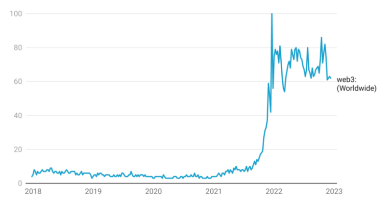

# 从机构角度看Web3的发展趋势

*Web3是指下一代互联网，也被称为分布式互联网。它是一种基于区块链技术的去中心化网络，可以实现人与人之间的直接交互和价值传递。Web3 很可能是互联网的未来。它涉及一个人们在分散的、几乎匿名的平台上操作的空间。这意味着要摆脱谷歌、Facebook 和 Twitter 等科技巨头的网络。*

# Web3热度不减

Crypto 和 DeFi 在 2022 年深陷熊市，但 Web3 方面的需求刚刚才开始获得关注。在过去的 12 个月里，Web3 相关的搜索与 2021 年底的峰值相比，一直保持在 30%以内，下一个上升趋势可能正在到来。

## Web3赛道依然处于早期

加密货币支付公司TripleA的数据显示，2022年全球加密货币用户将超3.2亿，约等于全球人口的4.2%。如果将加密货币当前的用户体量与互联网做对比，结论是目前加密货币的发展阶段大致相当于20世纪90年代末的互联网。2021年全球互联网用户数量达到49亿人，按照Global Macro Investor预测，全球加密货币用户数量预计将于2030年达到43亿，接近互联网的水平。因此，web3赛道当下依然处于早期，未来的潜力非常可观。

## Web3近三年投资概况

Last updated: 05/13/2023

上图展示了Web3近三年投资的情况。从图表中可以看出，Web3领域的投资在20-22年中呈现出了明显的增长趋势。其中，2022年是Web3投资的高峰期，投资总额达到了约180亿美元。而2023年上半年，由于国际社会上的宏观经济不景气，美联储持续加息，Web3领域的投资额度逐渐下降。今年第一季度，随着交易流量持续放缓，获得风险投资支持的 Web3 初创公司的资金达到了该领域成立以来的最低点。但可以预见的是，随着后疫情时代的走出，加密投资机构正在抓紧布局，尤其是web3基础设施，AI，LSD，多链生态等获得了广泛关注。

## 领先的Web3投资者的投资组合

Last updated: 05/13/2023

上图展示了领先的Web3投资者的投资组合情况。从图中可以看出，这些投资者的投资组合涵盖了Web3领域中的各个方面，包括去中心化金融、区块链基础设施、数字身份解决方案、NFT等。投资金额最大的公司是Polychain Capital，投资组合中的公司数量和投资金额都超过了其他公司。此外，投资金额排名前五的公司中有三家是加密货币风险投资公司，分别是Polychain Capital、Digital Currency Group和Coinbase Ventures。还有两家公司是传统风险投资公司，分别是Andreessen Horowitz和Sequoia Capital。需要注意的是，这张图表只展示了Web3领域的一部分投资情况，还有很多其他的投资公司也在积极涉足Web3领域。此外，这些投资公司的投资组合也在不断变化，投资重点也会随着市场的变化而发生变化。

# Web3独角兽按季度统计

Last updated: 05/13/2023

# 细分赛道的投资情况

从上图可以看出，web3独角兽出现的时间具有周期性，因此，Web3领域的投资重点也在不断变化。例如，在2019年，Web3领域的投资主要集中在去中心化应用和基础设施上。而到了2021年和2022年，去中心化金融（DeFi）和NFT成为了Web3领域的投资热点。此外，Web3领域的投资也在不断地涌现新的领域，例如去中心化身份验证（DID）和区块链游戏等。在DeFi板块，据DefiLlama的数据，从2020年DeFi市场的总锁定价值（TVL）从年初的8.85亿美元增长到2021年末的最高峰180亿美元，增长约20余倍。 此后2022年Q2开始，锁仓价值开始大幅下降，之后总体依然保持平稳。

# 总结

随着区块链技术的广泛采用，Web3 已成为企业家和建设者的创新前沿。

本文从加密投资机构的角度介绍了Web3的发展趋势和近三年的投资情况。该行业仍处于起步阶段，并迅速发展，趋势每月都在变化，保持领先并掌握最近的市场动态变得至关重要。同时，随着全球加密货币用户数量的增加，Web3领域的投资呈现出了明显的增长趋势，未来的潜力非常可观。总的来说，本文为我们提供了对Web3当前发展的全面了解，为我们深入了解和参与Web3领域的发展提供了重要的参考。

# 参考

1. 深潮：****2023年值得关注的9个Web3发展趋势****[https://www.techflowpost.com/article/detail_11130.html](https://www.techflowpost.com/article/detail_11130.html)
2. A16z关于**2023 加密市场现状报告** [https://a16zcrypto.com/content/article/state-of-crypto-report-2023/](https://a16zcrypto.com/content/article/state-of-crypto-report-2023/)
3. DefiLlma [https://defillama.com/?tvl=true](https://defillama.com/?tvl=true)
4. ****2023Q1 加密投融资报告**** [https://www.chaincatcher.com/article/2091100](https://www.chaincatcher.com/article/2091100)
5. ****投资人必须关注的2023科技新风向**** [https://finance.sina.com.cn/chanjing/gsnews/2023-01-10/doc-imxzsywf1176511.shtml](https://finance.sina.com.cn/chanjing/gsnews/2023-01-10/doc-imxzsywf1176511.shtml)