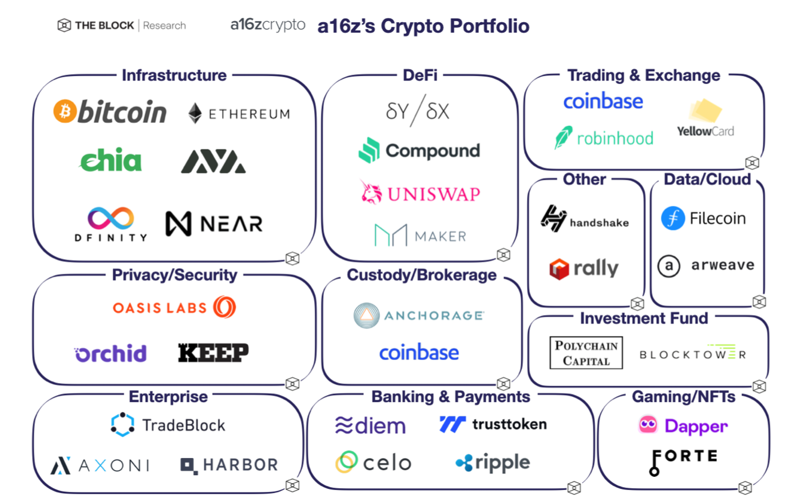

# A16z在加密领域的投资策略

## **简介**

A16z（Andreessen Horowitz）是一家成立于2009年的美国私人风险投资公司，也是**迄今最大的加密VC。**其最初的起步资产不足3亿美元，主要投资于互联网领域。

A16z早期吸引了一大批出色的企业，如Facebook、Instagram、Skype、Groupon和Twitter等，成功为它们提供投资。在Crypto领域，在2013年比特币还被视为 "庞氏骗局" 的年代，a16z开始着眼于加密技术，成为这个领域的领先投资者。这一决策不仅是a16z的胆识和远见所在，也是该公司能够在加密货币投资中取得成功的关键所在。目前，a16z在区块链相关项目中的投资涵盖了NFT、DeFi、GameFi、稳定币、Web3.0、DAO等领域，它一直在寻找更多的创新性区块链项目来扩大其投资组合。

## **在加密领域的投资情况**

a16z首次进入加密货币市场的投资项目是跨境支付解决方案Ripple，随后于2013年领投了当时仅有8个人的加密货币交易所Coinbase，并完成了2500万美元的B轮融资。自此，a16z在2013年至2020年期间的8年时间内，先后对Coinbase进行了8次投资，并最终成为了Coinbase上市后的最大外部赢家。目前，a16z的资金管理规模已超过百亿美元，是加密货币投资的风向标。以下是a16z crypto的投资版图：

为了进一步扩大在加密货币市场的影响力，a16z于2018年设立了a16z crypto，其第一个加密货币基金集资达3亿美元，而2020年和2021年，它又分别集资了5.15亿美元和22亿美元的第二和第三个加密货币基金。最近宣布的第四个加密货币基金规模高达45亿美元，这也是a16z迄今为止规模最大的加密货币基金，使得由a16z主导的加密货币基金总规模超过76亿美元。其中，15亿美元将用于对Web3进行种子投资，30亿美元则用于更传统的初创企业风险投资。下表为a16z迄今为止较为著名的投资案例：

| 序号 | 项目名称 | 领域 | 投资时间 | 投资金额 | 领投/跟投 | 其他投资机构 |
| --- | --- | --- | --- | --- | --- | --- |
| 1 | Coinbase | 加密货币交易所 | 2013年 | 1100万美元 | 跟投 | - |
| 2 | Uniswap | 去中心化交易协议 | 2018年 | 150万美元 | 跟投 | - |
| 3 | MakerDAO | 稳定币发行平台 | 2018年 | 1500万美元 | 跟投 | - |
| 4 | Dfinity | 区块链基础设施 | 2018年 | 6100万美元 | 跟投 | Polychain Capital |
| 5 | Kyber Network | 去中心化交易协议 | 2018年 | 700万美元 | 跟 |  |
| 6 | Compound | 去中心化借贷协议 | 2018年 | 840万美元 | 跟投 | - |
| 7 | Oasis Labs | 区块链基础设施 | 2018年 | 450万美元 | 跟投 | - |
| 8 | Polychain Capital | 加密货币基金 | 2018年 | 1.9亿美元 | 跟投 | - |
| 9 | Stacks | 区块链基础设施 | 2019年 | 2300万美元 | 领投 | - |
| 10 | Aave | 去中心化借贷协议 | 2019年 | 1亿美元 | 跟投 | - |
| 11 | BlockFi | 加密货币借贷平台 | 2019年 | 1800万美元 | 跟投 | Valar Ventures, Fidelity |
| 12 | Synthetix | 去中心化合成资产 | 2019年 | 390万美元 | 跟投 | - |
| 13 | Helium | 区块链基础设施 | 2019年 | 1500万美元 | 跟投 | Khosla Ventures |
| 14 | Opyn | 期权协议 | 2020年 | 200万美元 | 跟投 | Dragonfly Capital |
| 15 | Arweave | 区块链基础设施 | 2020年 | 800万美元 | 跟投 | - |
| 16 | Celo | 区块链基础设施 | 2020年 | 2500万美元 | 跟投 | - |
| 17 | Curve | 稳定币交易协议 | 2020年 | 1100万美元 | 跟投 | - |
| 18 | Dapper Labs | NFT游戏开发商 | 2018年 | 1500万美元 | 跟投 | - |
| 19 | Nexus Mutual | 去中心化保险 | 2020年 | 1200万美元 | 跟投 | - |
| 20 | Rally | 社交代币发行平台 | 2021年 | 1200万美元 | 跟投 | - |
| 21 | The Graph | 区块链基础设施 | 2021年 | 2500万美元 | 跟投 | - |
| 22 | Nexus Mutual | 去中心化保险 | 2021年 | 700万美元 | 跟投 | - |
| 23 | Mirror | 区块链基础设施 | 2021年 | 800万美元 | 领投 | - |
| 24 | Bitso | 拉美区块链交易所 | 2021年 | 2500万美元 | 跟投 | Kaszek Ventures, QED Investors |
| 25 | Zapper | 加密资产管理平台 | 2021年 | 1500万美元 | 跟投 | - |

从表格中可以看出，A16z的加密货币投资覆盖了多个领域，包括加密货币交易所、DeFi协议、加密货币基金、区块链基础设施等。从投资额度方面看，A16z在加密货币领域的投资金额呈逐年增长的趋势。其中，最早的几个项目投资金额相对较小，但是后来的投资金额逐渐增加。特别是在2018年以后，A16z的投资额度增长非常迅速。这也反映了A16z对加密货币领域未来发展的信心和看好程度。从投资年份的变化来看，A16z最早的加密货币投资可以追溯到2013年。此后，A16z在加密货币领域的投资逐渐增加，尤其是在2018年以后，A16z开始加大对加密货币领域的投资力度，并设立了多个加密货币基金。可以看出，A16z对加密货币领域的关注和参与度在逐年增强。

综上所述，A16z在加密货币领域的投资金额呈逐年增长的趋势，且对加密货币领域的关注和参与度在逐年增强。

## **投资策略和组合**

在进入加密资产投资行业近6年后，a16z已经投资了不下于40个区块链项目。这些项目大多具有很高的知名度，覆盖公链、稳定币、交易所、支付等领域。

a16z所投资项目多为技术流的「硬核」项目，例如DFINITY、Oasis labs以及Ripple等，都具有相当出色的技术团队与较为新锐的技术理念。同时，a16z的投资对象几乎都是基础设施类项目，特别是那些定位于「服务器时代」与「云时代」的底层项目，几乎没有直接投资应用类项目。但a16z亦投资过著名DApp CryptoKitties的开发公司Dapper Labs，通过投资DApp开发商来降低DApp领域的投资风险。

a16z特别乐于在自己看好的项目上压下重注，近几年投资案例中超过50%都属于追加投资。a16z还积极为被投项目提供投后服务，把「为创业者提供钱以外的附加价值」这件事做到了极致。a16z也非常信奉长期价值投资的力量。根据a16z官方表述，在其投资加密资产的5年来从未未出售过其中任何一笔投资，并表示短期内不会有出售计划，而且他们希望进行持有10年以上的投资。

a16z的加密资产投资回报率仍然会比较可观，其投资的多数加密货币资产尚未进入交易所，例如Chia、Celo、DEFINITY等，都是备受瞩目、前景可观的项目。此外，a16z投资的多个区块链股权项目也都具有非常好的成长性，例如Coinbase、OpenBazaar等。

## 总结

相比国内的众多加密货币投资机构，A16z在团队背景、历史业绩和资源人脉方面都更加强大，几乎不属于同一境界层面。

在加密货币投资领域，投资机构的作用比其他行业更为复杂和重要，因为它们的投资决策在很大程度上影响着加密货币市场的走势和行业发展。国内很多加密货币投资机构由于缺乏技术和投资经验，往往投资的项目质量参差不齐，或者通过大量投机行为恶化加密货币生态，甚至与项目方勾结共同收割韭菜。相比之下，A16z的投资理念更加长远和具有行业意义，坚持长期价值投资并且在技术敏感性、投后服务和团队文化等方面做得更好。Chris Dixon曾将区块链比作硅谷再次升起的海盗旗，而A16z则与其投资项目一起引领海盗船向更远处驶去，一个崭新的时代也许正在徐徐展开。

## 参考

1. A16z关于**2023 加密市场现状报告** [https://a16zcrypto.com/content/article/state-of-crypto-report-2023/](https://a16zcrypto.com/content/article/state-of-crypto-report-2023/)
2. **一文总览 a16z 的 Web3 投资版图** [https://foresightnews.pro/article/detail/6520](https://foresightnews.pro/article/detail/6520)
3. **a16z的区块链世界观与投资观** [https://www.weiyangx.com/327946.html](https://www.weiyangx.com/327946.html)
4. **深度数据分析a16z加密布局** [https://www.jinse.com/blockchain/3143849.html](https://www.jinse.com/blockchain/3143849.html)
5. **顶级风投A16Z，继续布局Web3** [https://foresightnews.pro/article/detail/6573](https://foresightnews.pro/article/detail/6573)
6. **解析a16z的投資版圖：2022年領投的27個加密項目** [https://news.cnyes.com/news/id/4962571](https://news.cnyes.com/news/id/4962571)

